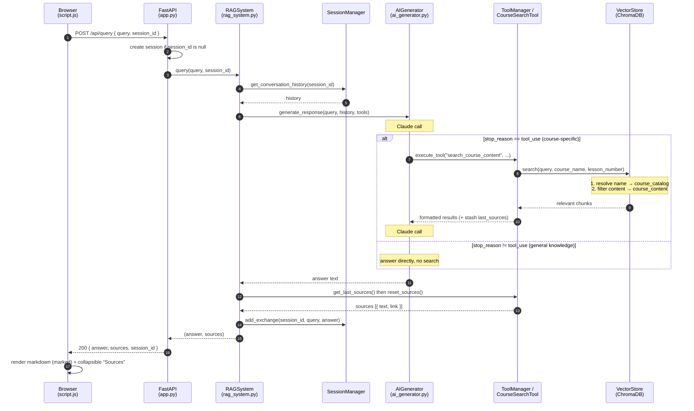

# Query Sequence Diagram

Sequence of a user query through the RAG system, from the browser to the rendered
answer. Renders anywhere Mermaid is supported (GitHub, VS Code, most Markdown viewers).

See also `architecture.html` for the component/flow diagram, and the project `CLAUDE.md`
for the narrative walkthrough.

## Notes

- **`alt / else`** is the defining branch: the `tool_use` path makes two Claude calls
  with a search between them; the general-knowledge path is a single call, no search.
- **Sources flow out-of-band** — stashed on `CourseSearchTool.last_sources` during the
  search, then pulled via `get_last_sources()` and cleared with `reset_sources()` *after*
  the answer returns, never through Claude's text response.
- **History** is read before generation and written after, so the current turn is not in
  its own context.
